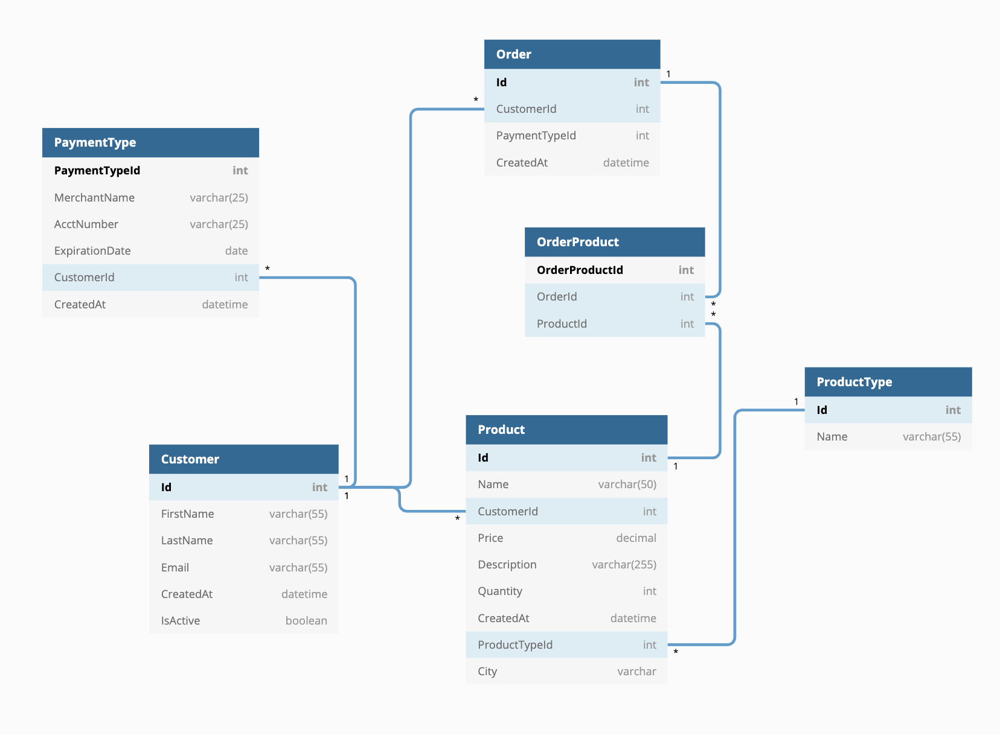

## python-bangazon-api-template

# Welcome to Bangazon

This web application is the source code for the Bangazon e-commerce web site. It is powered by Python and Django.

## Link to ERD



# Core Technologies

## Python

This project uses Python and its web framework Django.

[Python Getting Started](https://www.python.org/about/gettingstarted/)

[Download Python](https://www.python.org/downloads/)


## Setup Virtual Environment

Enable a virtual environment at the level above your project.

Use the following commands in your terminal:
```
virtualenv env
source env/bin/activate
```
## Dependencies

Activate your vim and run `pip install -r requirements.txt`


### Django Project / Django App

Django is a Python Web framework. This project uses Django and requires Python to be installed. See above note on installing Python.

[Django Install](https://docs.djangoproject.com/en/2.2/topics/install/)

[Django for Windows](https://docs.djangoproject.com/en/2.2/howto/windows/)

# Installing Bangazon

As of now, the database is going to be hosted on your local computer. There are a few things you need to make sure are in place before the database can be up and running.

1. Fork and clone the repo on to you local machine.

2. Run makemigrations
`python manage.py makemigrations website`

3. Run migrate
`python manage.py migrate`
>This will create all the migrations needed for Django Framework to post items to the database based on the models in the Models/ directory

<!-- 4. Add initial data
`python manage.py loaddata db.json`
>This will load data from the project's json file to your local database -->

## Run Server

`python manage.py runserver `
Ctrl+C to quit

## Using the App
`http://localhost:3000` is the domain you will use to access the app.

### Index
Once you access `http://localhost:3000` you will be directed to the main page where the latest 20 products are listed.

If you are not logged in you will see a navigation bar with the following links:
Bangazon(Home Page), Product Categories, Sell Product, My Profile, Login, and Register

Once you login you will see a navigation bar as follows:
Bangazon(Home Page), Product Categories, Sell Product, My Profile, Login, and Register

### Product Category
`http://localhost:3000/prouctcategory/`
Displays a listing of product categories with a total number of products in that category to the right of the category name.  Additionally, you will see the last three products added to the category.

### Sell Product
`http://localhost:3000/productform/`
Displays a form allowing a user to add product to sell on Bangazon.  This link will only be visible to authenticated users.  The person filling out the form will be able to enter a title, description, price, quantity, and a product type.

### My Settings
`http://localhost:8000/mysettings/`
Displays the customer information related to the logged in user.  There the user will see address, phone number, a button for payment methods, and a link to order history.

    Payment Methods:
        Displays a list of all available payment methods for the user.  The user will also have the ability to delete payment methods from this screen.

    Order History:
        Displays a list of the user's order history with links to the order details.  The order details will include information about each line item incuding price.  The order total will also be displayed.


ReadMe.md written by Karla Gallegos